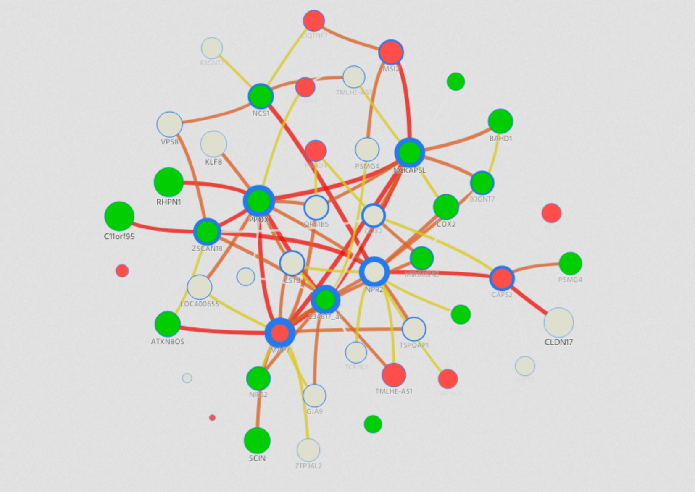

```{r setup, include=FALSE}
knitr::opts_chunk$set(echo = TRUE)
```

## Question 1

```{r}
#install.packages("devtools")
library(devtools)
#install_github("mategarb/R.ROSETTA")
library(R.ROSETTA)

```

## Question 2


```{r  echo=FALSE}

print(autcon)
decision_sum <- table(autcon$decision)
decision_sum

```

total number of features = 36 -1 = 35, since last one is class.


### For distribution:
```{r}

control_ratio <- as.numeric(decision_sum[1])/146
autism_ratio <- as.numeric(decision_sum[2])/146

```

Since controls and autism are nearly around 50% distributed thus the distribution is balanced


```{r}
autconDefault = rosetta(autcon)

rules <- autconDefault$main
quality <- autconDefault$quality
quality

```

Part a - Cross validation: Partition the data into equally sized subsets and perform model assesment.
**Rosetta performs 10 fold cross validation by default**

Part b - "Johnson" is the default reduction method. Reducer is used to find the dependencies in data.

Part c - The default method of discretization is **EqualFrequency**. It partitions the range of features a(x) into (n+1) intervals by placing cuts between features, so that each interval has the same number of objects. 
The default number of bins is 3.

Part d

```{r}
paste("Accuracy of model : " , quality$Accuracy.Mean)
```

Part e

```{r}

paste("Total number of rules : " ,nrow(rules))
paste("3 Most significant rules are:")
rules[(1:3),]

```

```{r}

ind <- rules$PVAL < 0.05
sig_rules <- rules$DECISION[ind]
class_control <- length(which(sig_rules == "control"))
class_autism <- length(which(sig_rules == "autism"))

paste("Number of significant rules for class control : " ,class_control)

paste("Number of significant rules for class autism : " ,class_autism)
```

Thus autism gets more significant rules.


## Question 5 and 6

### Control Network
```{r}

```

### Autism Network

```{r}

```


Controls:
There are 80 rules in decision "control". The most significant nodes with highest number of connections are "MAP7", "PPOX" , "NPR2","234817_at" and "NCKAP5L". Out of these significant nodes, "MAP7" is overexpressed and "PPOX", "234817_at", "NCKAP5L" are underexpressed.

Autism:
There are 111 rules in deciion "autism". The most significant nodes with highest number of connections are "COX2","RHPN1","PSMG4","SCIN","MAP7". It should be noticed that "MAP7" is either underexpressed or have no change in autism while in control it was overexpressed.

```{r}

```


```{r}

```


Calcium dependent gene expression regulates brain development and if it is compromised or develops abnormally, it might leads to autism. It can be observed that the calcium ion binding genes "SCIN","NCS1" and "CAPS2" have more densed network of connection in autism as compared to control.

SAFARI database contains information about autism related genes. It can be seen that we have "COX2" and "TMLHE-AS1" appears in our autism network which are also identified in SAFARI database symbolized as "CUX2" and "TMLHE".


```{r, ref.label=knitr::all_labels(),echo=TRUE,eval=FALSE}
```
